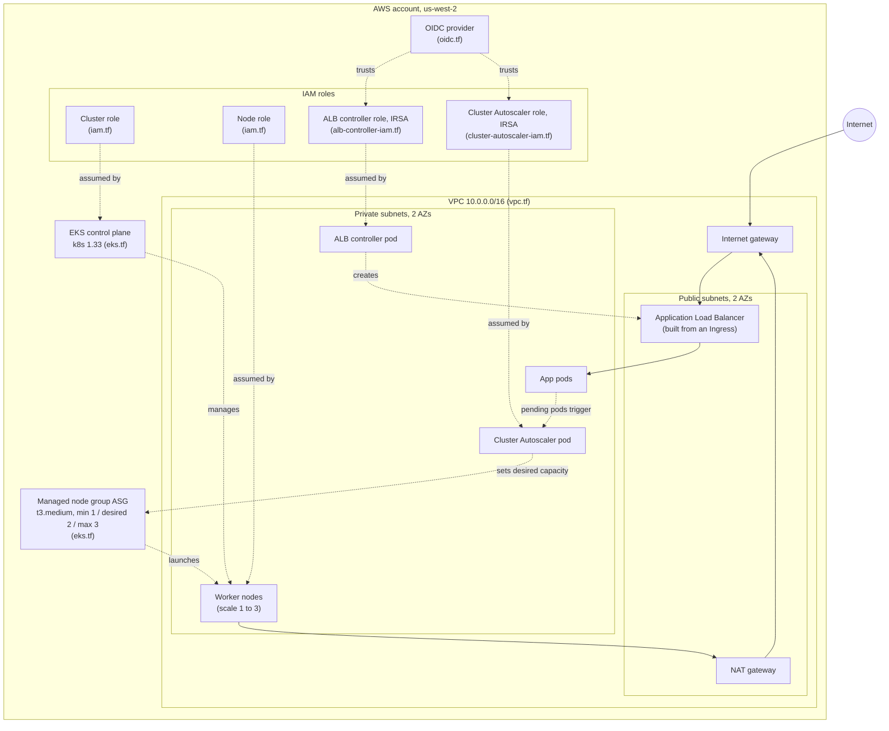

# PolyShop on EKS (AWS Load Balancer Controller)

Running the same PolyShop app tier on a real EKS cluster. The infrastructure
(VPC, cluster, node group, OIDC provider, IRSA roles) is built by Terraform in
`infra/terraform/` (see that directory's own README for the resource-by-resource
breakdown). This doc covers what happens after Terraform: installing the
controllers, deploying the app, the problems that showed up on EKS but not
locally, and how to tear it all down.

The Kubernetes manifests are the same ones from the local vCluster branch. Only
two things differ on EKS: the Ingress uses ALB annotations instead of nginx, and
the image tags point at the multi-arch builds. Everything else carries over.

## Architecture

```
Internet
   |
   v
Application Load Balancer          (public subnets, built by the ALB controller
   |                                from the Ingress object)
   |     /      -> frontend (React, nginx)
   |     /api   -> gateway  (Node/Express)
   |                  |
   |      +-----------+-----------+
   |      v                       v
   |  catalog (Java/Spring)   insights (FastAPI/Python)
   |      |                       |
   |      v                       v
   |  Postgres                  Redis            (StatefulSets on EBS volumes)
   |
   +-- worker nodes run in PRIVATE subnets; the ALB in the public subnets
       reaches pod IPs directly (target-type: ip, VPC CNI)
```

The app pods, datastores, and both controllers run on worker nodes in the
private subnets. The ALB sits in the public subnets and routes inbound traffic
to pod IPs. Postgres and Redis each get an EBS volume through a PersistentVolumeClaim.

## Provision the infrastructure (Terraform)

The Terraform in `infra/terraform/` is written by hand rather than with a
prebuilt module, so each resource is visible. It creates the network, the IAM
roles the cluster and nodes need, the cluster itself, a managed node group, and
the IRSA roles the AWS Load Balancer Controller and the Cluster Autoscaler need.
It does not install either controller — that split is on purpose: Terraform
owns the AWS infrastructure, Helm owns what runs inside the cluster.



The network comes first. The VPC holds two public and two private subnets
across two availability zones. Public subnets reach the internet through the
internet gateway. Private subnets reach the internet outbound through the NAT
gateway, but nothing from outside can reach them directly. Worker nodes run in
the private subnets, so they are not exposed.

Once the cluster exists, it has an OIDC issuer, which is what makes IRSA work.
The ALB controller role and the Cluster Autoscaler role each trust that OIDC
provider, scoped to one service account. When a controller pod runs (installed
later by Helm), it assumes its role and gets temporary AWS credentials, no
stored keys. A load balancer only appears when an Ingress is created; the ALB
controller watches for Ingress objects and builds one to match. The Cluster
Autoscaler works the same IRSA way: when pods cannot be scheduled for lack of
capacity, it calls the AWS Auto Scaling API to raise the node group's desired
count.

### What each file does

| File | What it does |
|------|--------------|
| `versions.tf` | Pins the Terraform version and the AWS and TLS providers. |
| `providers.tf` | Configures the AWS provider with the region. Uses the AWS CLI credentials already on the machine. |
| `variables.tf` | Inputs with defaults: region, cluster name, Kubernetes version, VPC CIDR, and the list of AZs. |
| `vpc.tf` | The network: VPC, two public and two private subnets, internet gateway, NAT gateway, route tables, and the subnet tags EKS and the ALB controller rely on. |
| `iam.tf` | The cluster role (trusted by the eks service) and the node role (trusted by ec2), with their managed policies. |
| `eks.tf` | The EKS control plane and the managed node group of t3.medium instances. |
| `oidc.tf` | The IAM OIDC provider for the cluster, the trust anchor for IRSA. |
| `alb-controller-iam.tf` | IAM policy and IRSA role for the AWS Load Balancer Controller. |
| `cluster-autoscaler-iam.tf` | IAM policy and IRSA role for the Cluster Autoscaler. |
| `outputs.tf` | Values printed after apply: cluster name/endpoint, the kubectl setup command, the OIDC provider ARN, and both controller role ARNs. |

### Usage

```bash
cd infra/terraform
terraform init      # download providers
terraform plan       # preview
terraform apply       # create everything, ~12-15 min, mostly the control plane
```

Connect kubectl using the command Terraform prints, then confirm the nodes
joined:

```bash
aws eks update-kubeconfig --name polyshop-eks --region us-west-2
kubectl get nodes
```

State is stored locally (`infra/terraform/terraform.tfstate`, gitignored).
Moving it to an S3 backend with DynamoDB locking is the next step for shared
or team use.

**Cost:** the control plane, the two t3.medium nodes, and the NAT gateway all
bill by the hour, and an ALB adds more once an Ingress exists. Tear down when
done (see Teardown below).

## What you need before deploying

- The Terraform infra already applied (cluster `polyshop-eks`, region `us-west-2`).
- `kubectl`, `aws` CLI, `helm`, and `eksctl` installed and on PATH.
- kubeconfig pointed at the cluster:

```bash
aws eks update-kubeconfig --name polyshop-eks --region us-west-2
kubectl get nodes        # expect the worker nodes Ready
```

- Multi-arch images pushed. EKS nodes are amd64; a Mac builds arm64 by default.
  Build for both so the same tag runs anywhere:

```bash
docker buildx build --platform linux/amd64,linux/arm64 \
  -t skaftab/polyshop-catalog:0.2.0 --push ./catalog
# repeat for gateway:0.2.0, frontend:0.2.0, insights:0.1.0
```

Check an image is multi-arch before trusting it:

```bash
docker buildx imagetools inspect skaftab/polyshop-catalog:0.2.0 | grep Platform
# want to see both linux/amd64 and linux/arm64
```

## Install the controllers

Terraform builds the IAM roles but installs no controllers. You install three
things with Helm and one addon: the AWS Load Balancer Controller, the Cluster
Autoscaler, metrics-server, and the EBS CSI driver.

### AWS Load Balancer Controller

Uses the IRSA role Terraform made. Values live in `infra/helm/alb-values.yaml`,
which needs the current cluster's VPC ID. A fresh `terraform apply` makes a new
VPC, so update this before installing or the controller installs healthy and
then never builds a load balancer.

```bash
aws eks describe-cluster --name polyshop-eks --region us-west-2 \
  --query "cluster.resourcesVpcConfig.vpcId" --output text
# put that value in infra/helm/alb-values.yaml vpcId

helm repo add eks https://aws.github.io/eks-charts
helm repo update
helm install aws-load-balancer-controller eks/aws-load-balancer-controller \
  -n kube-system -f infra/helm/alb-values.yaml
```

Check it:

```bash
kubectl get deployment -n kube-system aws-load-balancer-controller       # want 2/2
kubectl get sa aws-load-balancer-controller -n kube-system \
  -o jsonpath="{.metadata.annotations}"                                   # shows the role ARN
```

### Cluster Autoscaler

Uses its own IRSA role. Values in `infra/helm/ca-values.yaml`. The service
account name in that file must match the role's trust policy, and the image tag
must match the cluster's Kubernetes version.

```bash
helm repo add autoscaler https://kubernetes.github.io/autoscaler
helm repo update
helm install cluster-autoscaler autoscaler/cluster-autoscaler \
  -n kube-system -f infra/helm/ca-values.yaml
```

Check it:

```bash
kubectl get pods -n kube-system -l app.kubernetes.io/name=aws-cluster-autoscaler
kubectl logs -n kube-system -l app.kubernetes.io/name=aws-cluster-autoscaler --tail=20
```

### metrics-server

Needed by the HPAs. Not installed by default. On EKS the kubelet certs are
properly signed, so unlike the local cluster you do NOT add `--kubelet-insecure-tls`.

```bash
kubectl apply -f https://github.com/kubernetes-sigs/metrics-server/releases/latest/download/components.yaml
kubectl get deployment metrics-server -n kube-system     # want 1/1
kubectl top nodes                                        # want real CPU/memory numbers
```

### EBS CSI driver (needed for the datastores)

This is the one that has no local equivalent, so it is easy to miss. The local
vCluster had a built-in storage provisioner. EKS does not, so the Postgres and
Redis PVCs cannot bind until the EBS CSI driver is installed AND has permission
to create volumes. Install order matters here, so read the whole section before
running it.

The driver needs an IAM role. Relying on the node role over IMDS is unreliable
(the controller flickers between healthy and crashing). Give it a dedicated IRSA
role instead:

```bash
eksctl create iamserviceaccount \
  --cluster polyshop-eks --region us-west-2 \
  --namespace kube-system --name ebs-csi-controller-sa \
  --attach-policy-arn arn:aws:iam::aws:policy/service-role/AmazonEBSCSIDriverPolicy \
  --role-only --role-name polyshop-eks-ebs-csi-role --approve
```

Then install the addon WITH the role attached from the start, so the controller
pods boot with credentials on the first try:

```bash
aws eks create-addon --cluster-name polyshop-eks --region us-west-2 \
  --addon-name aws-ebs-csi-driver \
  --service-account-role-arn arn:aws:iam::xxxxxxxxxxxx:role/polyshop-eks-ebs-csi-role
```

Check it. The controller runs six containers; wait for 6/6:

```bash
kubectl get pods -n kube-system | grep ebs-csi-controller     # want 6/6 Running, stable
```

### Default StorageClass

The driver still needs a StorageClass telling PVCs how to provision. EKS ships a
`gp2` class, but it is not marked default and it uses the old in-tree provisioner,
not the CSI driver. Create a gp3 class backed by the CSI driver and mark it default:

```bash
kubectl apply -f - <<'EOF'
apiVersion: storage.k8s.io/v1
kind: StorageClass
metadata:
  name: gp3
  annotations:
    storageclass.kubernetes.io/is-default-class: "true"
provisioner: ebs.csi.aws.com
volumeBindingMode: WaitForFirstConsumer
parameters:
  type: gp3
EOF

kubectl get storageclass       # gp3 should show (default)
```

`WaitForFirstConsumer` delays volume creation until the pod is scheduled, so the
EBS volume lands in the same availability zone as the pod. Without it you can get
a volume in one AZ and a pod in another, and the volume never attaches.

## Smoke-test the controllers before deploying the app

Worth doing once, so a silent auth failure doesn't waste time debugging the real
app later. `infra/smoke-test/` has a throwaway nginx Deployment + ALB Ingress
for exactly this.

Cluster facts this assumes: `polyshop-eks`, region `us-west-2`, Kubernetes 1.33,
one managed node group of `t3.medium` (min 1, desired 2, max 3).

**Verify IRSA first.** Prove the autoscaler can actually reach AWS:

```bash
kubectl get pods -n kube-system -l app.kubernetes.io/name=aws-cluster-autoscaler
kubectl logs -n kube-system -l app.kubernetes.io/name=aws-cluster-autoscaler --tail=20
```

Pod should be `1/1 Running`. In the logs, look for it discovering the ASG (a
line like `Found ... availability zones for ASG "eks-polyshop-eks-nodes-..."`)
and confirm there's no `AccessDenied`. Discovering the ASG means IRSA works.

**Deploy nginx behind the ALB:**

```bash
kubectl apply -f infra/smoke-test/nginx.yaml
kubectl apply -f infra/smoke-test/ingress.yaml
kubectl get ingress nginx -w
```

ADDRESS is empty at first, then fills with a `k8s-default-nginx-...elb.amazonaws.com`
name in a few seconds; the ALB needs another minute or two to pass health checks.
Then `curl http://<ADDRESS>` should return the nginx welcome page, proving
Internet → ALB → pod.

**Force a scale-up.** Each nginx pod requests 500m CPU; a `t3.medium` gives about
1.9 usable CPU, so scaling to 8 replicas (4 CPU) overflows the current nodes:

```bash
kubectl scale deployment nginx --replicas=8
kubectl get pods                      # some Running, some Pending
kubectl get nodes -w                  # a new node appears NotReady then Ready
kubectl logs -n kube-system -l app.kubernetes.io/name=aws-cluster-autoscaler --tail=30 \
  | grep -E "unschedulable|scale-up|setting group size"
```

Look for `Scale-up: setting group ... size to 3` in the log.

**Scale back down** (`kubectl scale deployment nginx --replicas=2`) and expect
pods to drop immediately but nodes to lag behind — deliberately, to avoid
thrashing:

- ~10 minute cooldown after any scale-up before scale-down starts
  (`scaleDownInCooldown=true` in the log)
- a node is only removed after being continuously unneeded for ~10 minutes,
  and only if every pod on it can move elsewhere
- a node hosting a kube-system pod with no PodDisruptionBudget (e.g. the ALB
  controller or coredns) is refused as unremovable even when nearly idle
- nodes are removed one at a time; the unneeded timer resets after each removal
- the node group min is 1, so it never scales below one node

Removal shows as a `ToBeDeletedByClusterAutoscaler` taint, then `deleting pod
for node scale down` (the drain), then the instance terminates.

**Tear down the smoke test** before moving on (leaving it running just burns
cost for nothing):

```bash
kubectl delete -f infra/smoke-test/ingress.yaml
kubectl get ingress                   # expect none
aws elbv2 describe-load-balancers --region us-west-2 \
  --query "LoadBalancers[?contains(LoadBalancerName, 'k8s-default-nginx')].LoadBalancerName"
# wait until that returns nothing, then:
kubectl delete -f infra/smoke-test/nginx.yaml
```

**Gotchas:** the two Helm values files' `serviceAccount.name` must exactly match
each IAM role's trust policy (`system:serviceaccount:kube-system:<name>`) — a
mismatch makes AWS refuse the role, the pod keeps running, and scaling fails
silently with no crash. Pin the autoscaler's `image.tag` to a published version
matching the cluster's Kubernetes minor version, or it sits in `ImagePullBackOff`.

## Deploy the app

Confirm you are on the right branch and the right cluster before applying, since
the local and EKS branches differ and the wrong context would deploy to the wrong
place.

```bash
git branch --show-current                # main (the EKS branch)
kubectl config current-context           # ...cluster/polyshop-eks
```

Apply in phase order:

```bash
kubectl apply -f k8s/00-namespace/namespace.yaml
kubectl apply -f k8s/10-datastores/
kubectl get pods -n polyshop             # wait for postgres-0 and redis-0 to be 1/1
kubectl get pvc -n polyshop              # both should be Bound

kubectl apply -f k8s/20-app/
kubectl get pods -n polyshop -w          # all six 1/1 (catalog slowest)

kubectl apply -f k8s/30-ingress/
kubectl apply -f k8s/40-autoscaling/
```

Watch the ALB address appear:

```bash
kubectl get ingress -n polyshop -w
```

The ADDRESS column fills in with a name like
`k8s-polyshop-polyshop-xxxx.us-west-2.elb.amazonaws.com` after a couple of
minutes. Give it a few minutes more before testing, because the ALB registers
targets and runs health checks after the address exists. Then:

```bash
curl http://<ALB-ADDRESS>/api/products   # product JSON, routed to gateway
# open http://<ALB-ADDRESS> in a browser  # UI, routed to frontend
```

## Problems that showed up on EKS but not locally

Every one of these came from the platform under the manifests, not the manifests
themselves. The YAML was correct on both clusters. Local hid this work; EKS makes
you do it.

**Datastores stuck Pending with unbound PVCs.** No EBS CSI driver was installed.
The local vCluster had a built-in provisioner, so PVCs bound on their own. On EKS
there was nothing to create the volume, so the pods could not schedule. Fixed by
installing the EBS CSI driver.

**EBS controller crash-looped at 1/6.** The driver was installed but had no AWS
credentials. Its log said `no EC2 IMDS role found`. Attaching the EBS policy to
the node role only helped intermittently. The reliable fix was a dedicated IRSA
role for the driver, the same pattern the ALB controller and autoscaler already
use.

**The addon got stuck in CREATING.** Because the controllers never passed health,
the addon would not report done and would not accept a role update
(`ResourceInUseException`). Deleting the addon and recreating it with the role ARN
on the create broke the deadlock, since the controllers then started with
credentials immediately.

**PVCs stayed Pending even with the driver healthy.** No default StorageClass, and
the existing gp2 class pointed at the old in-tree provisioner. Created a default
gp3 class on the CSI driver. The already-Pending PVCs had been created before the
class existed and a PVC's class is immutable, so they were deleted and let the
StatefulSets recreate them against the new default.

**Stale VPC ID in alb-values.yaml.** A fresh cluster gets a new VPC. The values
file still held the old VPC ID from an earlier run. Caught before install. Left
unfixed, the ALB controller runs healthy and silently never provisions a load
balancer.

**Images were arm64 only.** Built on an Apple Silicon Mac, so they would fail on
amd64 nodes with `exec format error`. Rebuilt multi-arch before deploying, so this
was prevented rather than hit. The nginx test never exposed it because the public
nginx image is already multi-arch.

## Health check note

The ALB health-checks every target group. By default it checks `/`. The frontend
answers `/`, so it passes. If the gateway does not return 200 on `/`, its target
group shows unhealthy and `/api` returns 503 even though the pod is fine. If that
happens, add a health check path annotation on the gateway Service pointing at a
route it actually serves.

## Teardown

Order matters. Delete the Ingress first so the controller removes the ALB cleanly.
Destroying Terraform while the ALB still exists can orphan the load balancer and
leak cost.

```bash
kubectl delete -f k8s/30-ingress/                              # ALB removed first
kubectl delete namespace polyshop                              # app, datastores, PVCs, EBS volumes

helm uninstall aws-load-balancer-controller -n kube-system
helm uninstall cluster-autoscaler -n kube-system
aws eks delete-addon --cluster-name polyshop-eks --region us-west-2 \
  --addon-name aws-ebs-csi-driver

cd infra/terraform && terraform destroy
```

Deleting the namespace removes the PVCs, which deletes the backing EBS volumes
(the gp3 class reclaim policy is Delete). Confirm no volumes or load balancers are
left behind before you consider the account clean:

```bash
aws elbv2 describe-load-balancers --region us-west-2 \
  --query "LoadBalancers[?contains(LoadBalancerName,'polyshop')].LoadBalancerName"
aws ec2 describe-volumes --region us-west-2 \
  --filters "Name=tag:kubernetes.io/created-for/pvc/namespace,Values=polyshop" \
  --query "Volumes[].VolumeId"
```

## Worth adding to Terraform later

Two of the manual steps above should live in Terraform so a fresh cluster never
hits them:

- An IRSA role for the EBS CSI driver, plus the addon installed with that role.
- The default gp3 StorageClass.

With those in the infra code, the storage problems in this doc disappear on the
next clean build.