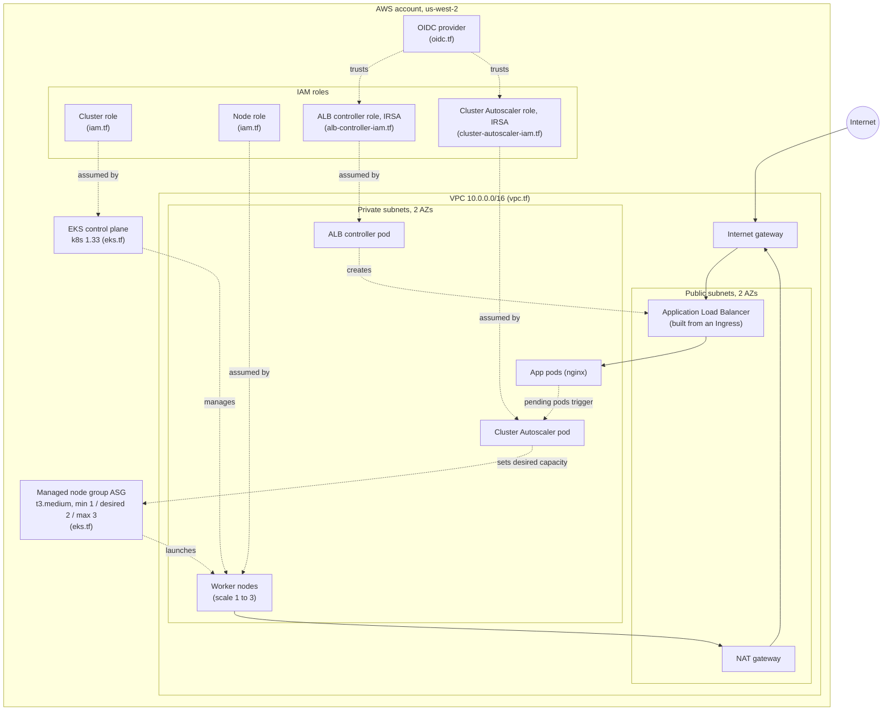

# PolyShop EKS (Terraform)

This repo builds an Amazon EKS cluster with Terraform, written by hand rather than
with a prebuilt module, so each resource is visible and easy to follow. It creates
the network, the IAM roles the cluster and nodes need, the cluster itself, a managed
node group, and the IRSA roles the AWS Load Balancer Controller and the Cluster
Autoscaler need to run.

Neither controller is installed by Terraform. Terraform builds the IAM roles and
policies for both, and each controller is installed separately with Helm. That split
is on purpose: Terraform owns the AWS infrastructure, Helm owns what runs inside the
cluster. See `ALB-AND-CA.md` for the install and test runbook.

## Architecture

## How the pieces connect

The network comes first. The VPC holds two public and two private subnets across two
availability zones. Public subnets reach the internet through the internet gateway.
Private subnets reach the internet outbound through the NAT gateway, but nothing from
outside can reach them directly. Worker nodes run in the private subnets, so they are
not exposed.

The control plane and the node group both reference the IAM roles and the subnets.
The cluster role lets the EKS service manage AWS resources. The node role lets the
worker EC2 instances join the cluster and pull images. Terraform reads the references
between these resources and builds them in the right order on its own.

Once the cluster exists, it has an OIDC issuer. The OIDC provider registers that
issuer with IAM, which is what makes IRSA work. The ALB controller role then trusts
that OIDC provider, scoped to one service account. When the controller runs (installed
by Helm), its pod assumes that role and gets temporary AWS credentials, with no stored
keys. That is how it is allowed to create load balancers.

A load balancer only appears when you create an Ingress. The controller watches for
Ingress objects and builds an ALB to match. The public subnets are tagged so the
controller knows where to place an internet-facing ALB.

The Cluster Autoscaler works the same IRSA way, with a different job. Its role is
also trusted by the OIDC provider, scoped to its own service account. When pods
cannot be scheduled for lack of capacity, the autoscaler calls the AWS Auto Scaling
API to raise the node group's desired count, and a new node joins. When nodes sit
idle it lowers the count again, conservatively. The node group carries the
`k8s.io/cluster-autoscaler/*` tags so the autoscaler can discover it.

## What each file does

| File | What it does |
|------|--------------|
| `versions.tf` | Pins the Terraform version and the AWS and TLS providers, so a clone builds against the same versions. |
| `providers.tf` | Configures the AWS provider with the region. Uses the AWS CLI credentials already on the machine. |
| `variables.tf` | Inputs with defaults: region, cluster name, Kubernetes version, VPC CIDR, and the list of AZs. |
| `vpc.tf` | The network. VPC, two public and two private subnets, internet gateway, NAT gateway, route tables, and the subnet tags EKS and the ALB controller rely on. |
| `iam.tf` | Two roles. The cluster role (trusted by the eks service) and the node role (trusted by ec2), with their managed policies. |
| `eks.tf` | The EKS control plane and the managed node group of t3.medium instances. Nodes run in the private subnets. |
| `oidc.tf` | The IAM OIDC provider for the cluster. The trust anchor that lets service accounts assume IAM roles (IRSA). |
| `alb-controller-iam.tf` | The IAM policy and IRSA role for the AWS Load Balancer Controller. The controller itself is installed with Helm. |
| `cluster-autoscaler-iam.tf` | The IAM policy and IRSA role for the Cluster Autoscaler. The autoscaler itself is installed with Helm. |
| `outputs.tf` | Values printed after apply: cluster name and endpoint, the kubectl setup command, the OIDC provider ARN, and the ALB controller and Cluster Autoscaler role ARNs. |

## Usage

Set up the working directory and download providers:

    terraform init

Preview what will be created:

    terraform plan

Create everything:

    terraform apply

This takes about 12 to 15 minutes, mostly the control plane. When it finishes,
connect kubectl using the command Terraform prints:

    aws eks update-kubeconfig --name polyshop-eks --region us-west-2

Confirm the nodes joined:

    kubectl get nodes

## Installing the ALB controller (Helm)

Terraform creates the IAM role for the controller but does not install the controller.
After apply, install it with Helm and point it at the role ARN from the Terraform
output. Fill in your own account ID, VPC ID, and role ARN:

    helm repo add eks https://aws.github.io/eks-charts
    helm repo update

    helm install aws-load-balancer-controller eks/aws-load-balancer-controller \
      -n kube-system \
      --set clusterName=polyshop-eks \
      --set serviceAccount.create=true \
      --set serviceAccount.name=aws-load-balancer-controller \
      --set "serviceAccount.annotations.eks\.amazonaws\.com/role-arn=<ALB_CONTROLLER_ROLE_ARN>" \
      --set region=us-west-2 \
      --set vpcId=<VPC_ID>

Then any Ingress with `ingressClassName: alb` will get a real Application Load Balancer.

## Cost

This is not free while it runs. The control plane, the two t3.medium nodes, and the
NAT gateway all bill by the hour, and an ALB adds more once you create an Ingress.
Tear it down when you are done.

Delete the Ingress first so the controller removes the ALB cleanly, then uninstall the
controller, then destroy the rest:

    kubectl delete ingress <name>
    helm uninstall aws-load-balancer-controller -n kube-system
    terraform destroy

Terraform removes everything in the correct order, so there is nothing left to clean up
by hand.

## Notes

State is stored locally. Moving it to an S3 backend with DynamoDB locking is the next
step for shared or team use.